<div align="center">


# Sidekicks

**A little crew. A lot done.**

Your AI coding agents, together on Mac and iPhone.

[Website](https://usesidekicks.com) · [Documentation](docs/README.md) · [Source](https://github.com/christsx/Sidekicks) · [MIT license](LICENSE)

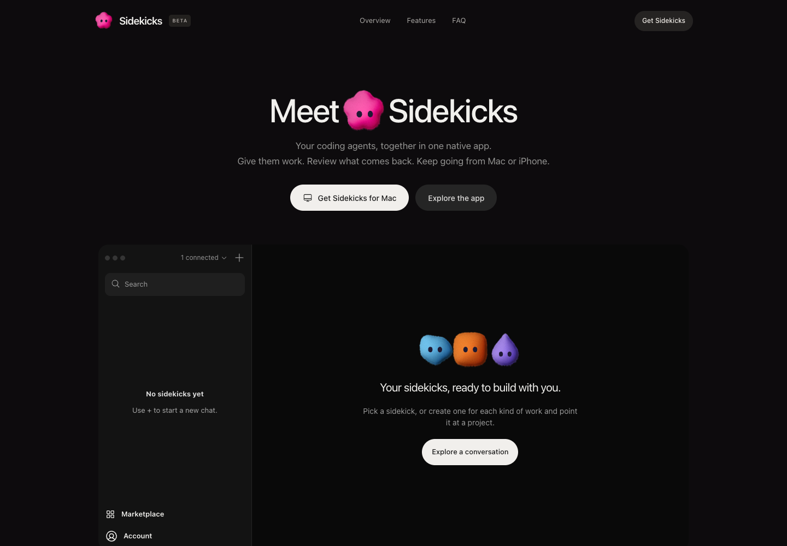

*Our website and illustrative product preview. The preview is not a live agent session.*

</div>

Sidekicks brings coding agents into persistent conversations. Give each sidekick
a name, instructions, a project, and a model provider. Send work, review approvals,
and follow progress from your desktop or phone.

## What you can do

- **Choose your coding agent.** Codex, Claude Code, Cursor, Gemini, OpenCode, Kimi,
  Z.ai through the GLM adapter, and other agents from the ACP registry.
- **Build your crew.** Named sidekicks, character avatars, group conversations,
  reply threads, standing instructions, memory, and routines.
- **Connect your tools.** The marketplace supports MCP connectors and browser
  sign-in. Granola adds meeting notes and decisions to your agent's context.
- **Work from iPhone.** Conversations, approvals, notifications, widgets, and
  Live Activities use the same host as desktop.
- **Use a Cloud Workspace.** An account's private Daytona sandbox runs the host
  independently of the Mac. Connect providers and GitHub inside that workspace.
- **Track work on Mac.** The native app includes a menu bar and an optional floating
  agent panel. Linux and terminal clients are also available.

These describe the source implementation. Installed builds can lag behind it;
provider support and signed-in workflows must be verified for each environment.

## iPhone app

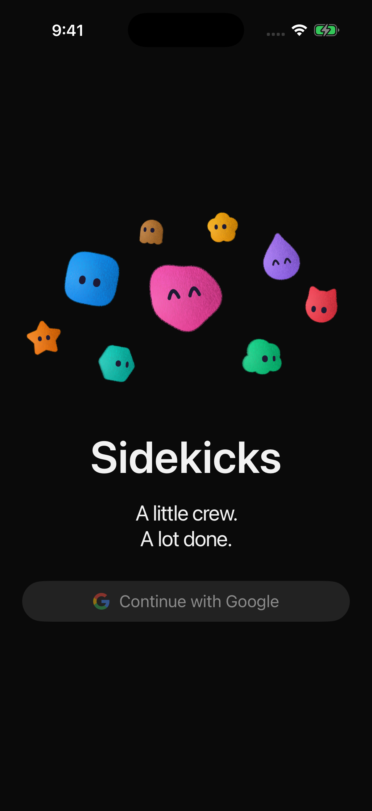

*Actual Sidekicks iPhone app captured in an isolated simulator. No account data or
meeting notes are included.*

Browse the [mobile feature tour](docs/guides/mobile-feature-tour.md) for the full feature inventory.
These native screens use isolated demo data; messages and approvals are samples.

| Your crew | Chat and approvals | Customize an agent |
|---|---|---|
| 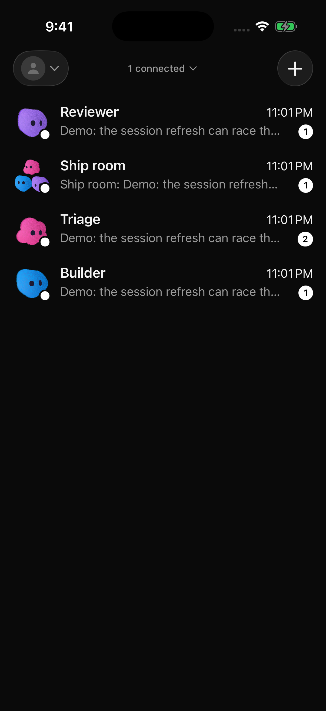 | 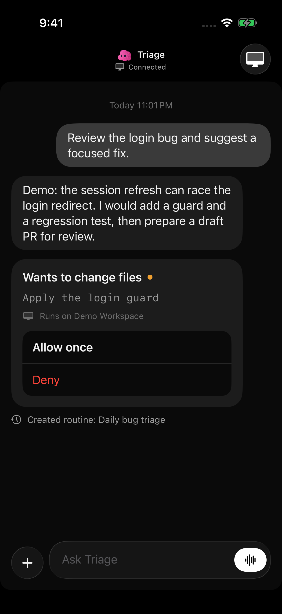 | 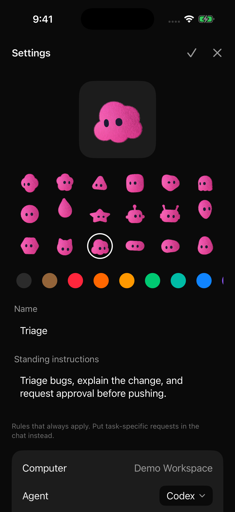 |
| Group conversations | Scheduled routines | Provider marketplace |
| 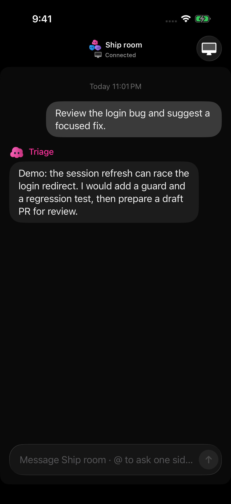 | 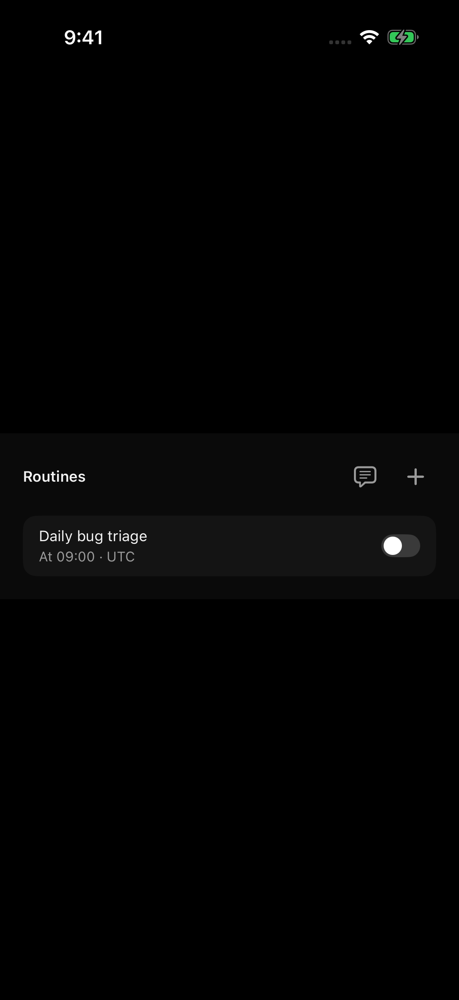 | 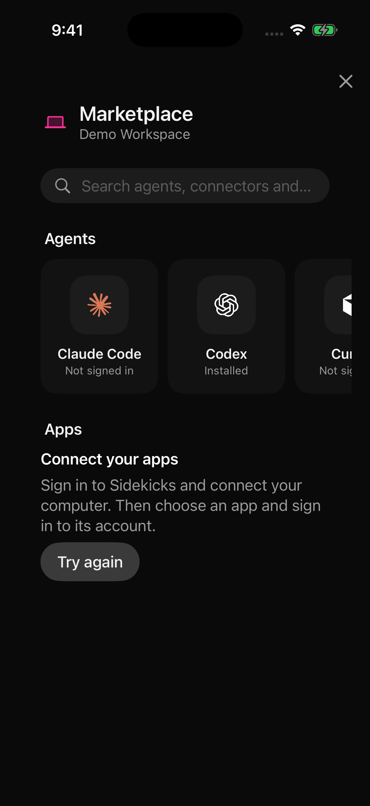 |
| Widgets | Live Activities | Cloud setup |
| 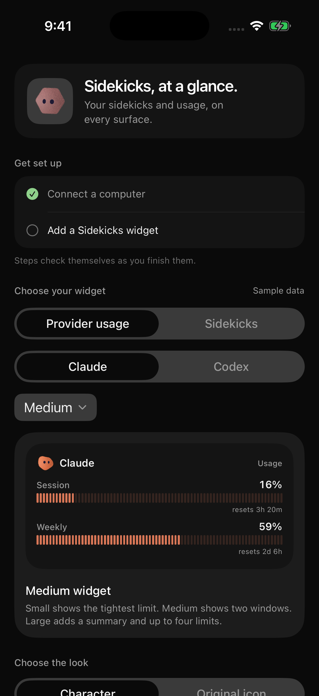 | 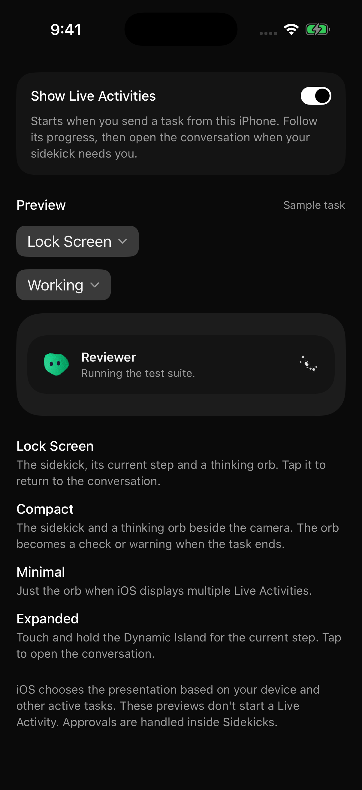 | 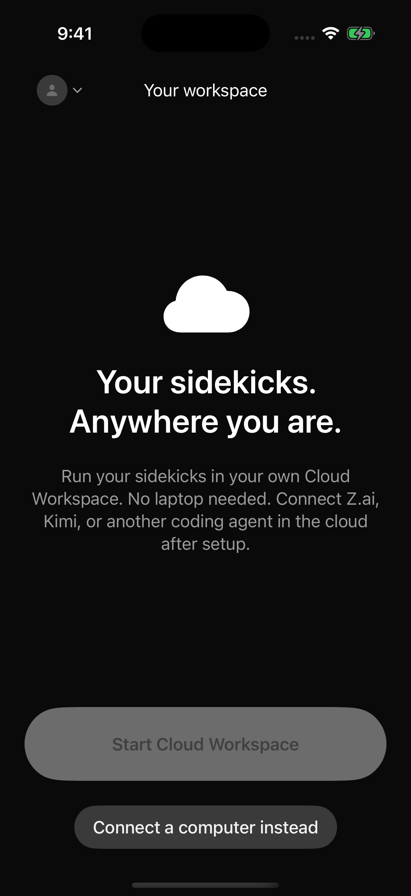 |

The iPhone beta is **invite-only through TestFlight**. Build 2.4.0 (30) was uploaded;
processing and pilot distribution were not confirmed during documentation review.
Later source changes, including Granola and the sign-out fix, are not in build 30.
There is no public TestFlight invitation or verified public App Store release yet.

## Choose where your agent runs

| Workspace | Mac can be closed? | Setup |
|---|---|---|
| Your Mac | No | Install and authenticate the coding provider on that Mac; pair the iPhone |
| Cloud Workspace | Yes | Enabled pilot account, Daytona workspace, provider login, and repository access |
| Linux or another server | Yes, if that server stays running | Run the host there and pair your client |

Existing Mac agents, chats, and credentials are not automatically migrated to the
cloud. Each workspace owns its files and provider credentials. Cloud compute and
AI provider usage can incur charges. The pilot workspace disables inactivity
auto-stop, so compute usage continues while it is running.

Start with [Cloud Workspace setup](docs/guides/cloud-workspace.md),
[provider and connector setup](docs/features/connector-credentials.md), and
[Granola](docs/guides/granola.md).

## Build from source

The active pilot work lives on `codex/sidekicks-testflight` in this repository.
Public signed Sidekicks installers and a Sidekicks Homebrew tap are not published.

```sh
git clone --branch codex/sidekicks-testflight https://github.com/christsx/Sidekicks.git
cd Sidekicks
xcodegen generate --spec apps/project.yml
xcodebuild build -project apps/Codync.xcodeproj -scheme macOS -configuration Debug
```

Use the `iOS` scheme in Xcode for iPhone or simulator builds. Configure your own
account and cloud services using the [development guide](docs/guides/development.md)
and [environment guide](docs/guides/environments-and-deployment.md).

For the host and terminal client:

```sh
cd host
cargo build
cargo run -- serve
# In another terminal, after starting the host:
cargo run -- tui
```

The executable remains `codync-host`; Swift modules, bundle identifiers, and source
paths retain their existing technical names. The product is called **Sidekicks**.

## Repository map

| Directory | Purpose |
|---|---|
| `apps/` | Native iPhone, Mac, and Linux clients |
| `apps/shared/` | Apple account integration |
| `kit/` | Shared Swift models, transport, and interface |
| `host/` | Rust host, ACP agents, transcript storage, MCP, and terminal UI |
| `cloud/` | Accounts, encrypted relay, and Cloud Workspace provisioning |
| `relay/` | Encrypted push delivery |
| `web/` | Sidekicks website |
| `packaging/` | Host, app, and sandbox distribution tooling |
| `docs/` | Setup, architecture, features, and verification records |

Build checks and contributor conventions are in [AGENTS.md](AGENTS.md).

## Attribution and license

Sidekicks is developed in this repository from the MIT-licensed
[Codync project by Po Kai Lee](https://github.com/leepokai/Codync).
The original copyright notice is preserved in [LICENSE](LICENSE).
See [our screenshot notes](docs/screenshots/README.md) for image provenance.
